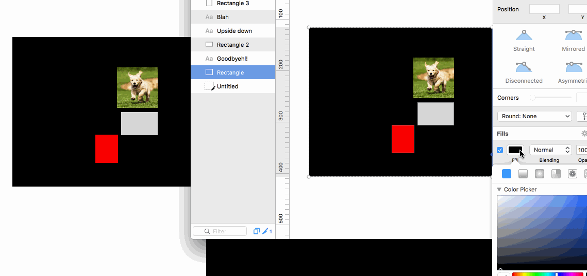

# elm-sketch-importer

Cymryd Sketch ffeil, ac trwy e mewn i Elm. Mae hwn daionus pryd mae gen chi eich dylunio mewn Sketch ac esial gael nhw mewn Elm yn gyflym. Nagw e'n cymryd lle o eich gwaith arferol.

Mae gwaith ar hyn yn mynd lan. Croseo fawr i pob PR!



## Gosod 

Rydym ni defnydd elm-format i neud yr Elm edrych yn pert, felly mae gwell gan chi os bydd e ganddo.

```
npm install -g elm-format
```

Mae elm-sketch-importer yn hawdd iawn i gosod.

```
npm install -g elm-sketch-importer
```

## Defyndd


```
Defyndd: [sketchffiel]

Options:
  -h, --help         Dangos help                                         [boolean]
  -o, --output       Rhowch yr lle bod chi'n angen yr Elm fynd
                                                          [cyfredol: "generated"]
  --ef, --elmformat  Rhowch yr lle bod eich elm-format byw
                                                         [cyfredol: "elm-format"]

Dangosiad:
  elm-sketch-importer ~/Documents/example.sketch
```


## Cymorth

## Layers

### Shapes ac rects

| Feature | Supported? |
|---------|-------------|
| Rectangles | :white_check_mark: |
| Layer positions | :white_check_mark: |
| Layer sizes | :white_check_mark: |
| Multiple layers | :white_check_mark: |
| Fills | :white_check_mark: |
| Border | :warning: |
| Border color | :warning: |
| Colored fills | :white_check_mark: |
| Other shapes | :warning: |
| Groups | :warning: |
| Slices | :warning: |
| Images | :white_check_mark: |


###  Text

Nac ydy testun hir yn mynd mas i Elm. Mae hwn lawr i yr faith bod BPLists yn anodd iawn i parsio mewn Elm. Bydd e'n dod cyn bod hir.


| Feature | Supported? |
|---------|------------|
| Short text       | :white_check_mark: |
| Long text | :warning: |
| Horizional/vertical flips | :white_check_mark: |
| Position | :white_check_mark: |
| Size | :warning: |
| Color | :warning: |
| Font | :warning: |


## Amserlen

Mae amserlen hwnw yn fod i bod blaenoriaeth. Nac ydy popeth arno yma, ac mae yr pethiau sy'n yma galli newid. Ond trwy gweitho i gilydd mae popeth galli dod yn gynt :)

# Cyn 1.0

- Relative layout instead of fixed pixels
- Full support for importing Sketch files
	- Make sure that no features remain unsupported

# Ti ol 1.0

- Export views to Sketch

# Misc

- Generating elm-css or style-element based views

